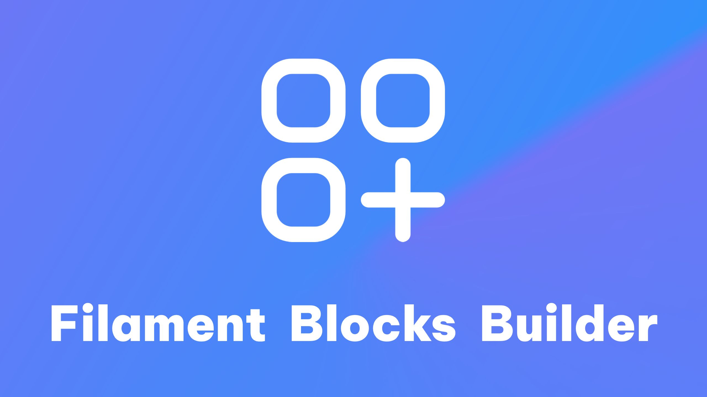

# Filament PHP Blocks Builder
[](https://github.com/bumbummen99/filament-blocks-builder/actions/workflows/tests.yml)
[](https://codecov.io/github/bumbummen99/filament-blocks-builder)
[](https://github.com/filamentphp/filament/)
[](https://packagist.org/packages/skyraptor/filament-blocks-builder)
[](https://packagist.org/packages/skyraptor/filament-blocks-builder)
[](https://github.com/bumbummen99/filament-blocks-builder/blob/master/LICENSE)

**Filament PHP Blocks Builder** is a plugin that adds a `BlockBuilder` form component, enabling you to design layouts using blocks on any resource you like. This flexible tool is suitable for building layouts, managing content, structuring data, and more.

## 📸Screenshots
Check out screenshots of the form components offerend by this package in [the screenshots directory](https://github.com/bumbummen99/filament-blocks-builder/blob/master/docs/SCREENSHOTS.md).

---

## 🚀Installation
Install the plugin via Composer:
```sh
composer require skyraptor/filament-blocks-builder
```

---

## 📘Useage
### Add Blocks Builder to a Resource
The Blocks Builder is a form component that can be added to any Filament PHP resource or form. Here’s how to use the `BlocksInput`:
```php
use SkyRaptor\FilamentBlocksBuilder\Blocks;
use SkyRaptor\FilamentBlocksBuilder\Forms\Components\BlocksInput;

BlocksInput::make('content')
    ->blocks(fn () => [
        Blocks\Layout\Card::block($form),
        Blocks\Typography\Heading::block($form),
        Blocks\Typography\Paragraph::block($form)
    ])
```

### Creating custom Blocks
A Block itself is a combination of a Filament PHP Form definition as well as the view required to render the Block on the frontend.
1. A **Filament PHP Form schema** for Block data definiton
2. A **Blade view** for frontend rendering

The package does include basic example Blocks, however it is **recommended** that you do create and maintain 
your own library of Blocks - this can be done in your project as well as in a package.

#### Implement the Block
Create a new class for your Block, extend the `Block` Contract and implement the required methods:
```php
<?php

namespace App\Filament\Blocks;

use Filament\Forms\Components;
use Filament\Forms\Form;

class Example extends \SkyRaptor\FilamentBlocksBuilder\Blocks\Contracts\Block
{
    public static function block(Form $form): Components\Builder\Block
    {
        return parent::block($form)->schema([
            Components\Textarea::make('content')
                ->required(),
        ]);
    }

    public static function view(): string
    {
        return 'example';
    }
}
```
Note the responsibilities of the methods shown in the implementation above:
- `block()`: This method initializes and configures a Filament PHP Form Component that represents this Block.
- `view`: This method does define the name of the view to be used on rendering the Block to the frontend.

#### Create the view
Create a [Blade view](https://laravel.com/docs/11.x/views) (e.g., `resources/views/example.blade.php`) to render the block's output. The schema data will be accessible within the view:
```php
<p>{{ $content }}</p>
```

#### Register the Custom Block
Add your custom block to the `BlocksInput`:
```php
->blocks(fn () => [
    Blocks\Layout\Card::block($form),
    Blocks\Typography\Heading::block($form),
    Blocks\Typography\Paragraph::block($form),
    // ...
    App\Filament\Blocks\Example::block($form)
])
```

---

## 🤝Contributing
Contributions are welcome! Submit a pull request on GitHub. Before submitting, ensure all tests pass.

### DevContainer
The project includes a DevContainer configuration for streamlined development. Open the `.code-workspace` file, and use the **Reopen in Container** option from the Remote Development menu in Visual Studio Code in order to use the DevContainer.

### Debugging
#### PHPUnit
Debug test cases directly using the *Debug Tests* configuration in Visual Studio Code. It runs PHPUnit with xDebug support.

#### Workbench
The Orchestral Workbench used for functional and browser based tests can also be previewed as well as debugged.

The [Orchestral Testbench](https://github.com/orchestral/testbench) is used for functional and browser-based tests, but can also be previewd and debugged. Follow these steps to set up the environment:

1. Use the following Orchestral Workbench command to generate an empty, persistent SQlite database in the Laravel skeleton.
   ```bash
   vendor/bin/testbench package:create-sqlite-db
   ```

2. Next you will have to run the Migrations defined in the Workbench using the command below.
   ```bash
   vendor/bin/testbench migrate
   ```

4. Now that the Orchestral Workbench environment has a functional database, you will have to create a user using the following command.
   ```bash
   vendor/bin/testbench make:filament-user
   ```

Use the *Debug Workbench* configuration in Visual Studio Code to preview and debug the workbench. It launches Laravel’s built-in server with xDebug.

---

## 🛠Todo
The following features and quality of life improvements have yet to be implemented and added to the library:
- Basic layout Blocks (flexbox, grid, ...)
- Block update / upgrade migrations

---

## 🛡️License
This project is licensed under the [GNU GPL v3](https://github.com/bumbummen99/filament-blocks-builder/blob/master/LICENSE) License.

---

Happy Building! 🎉
